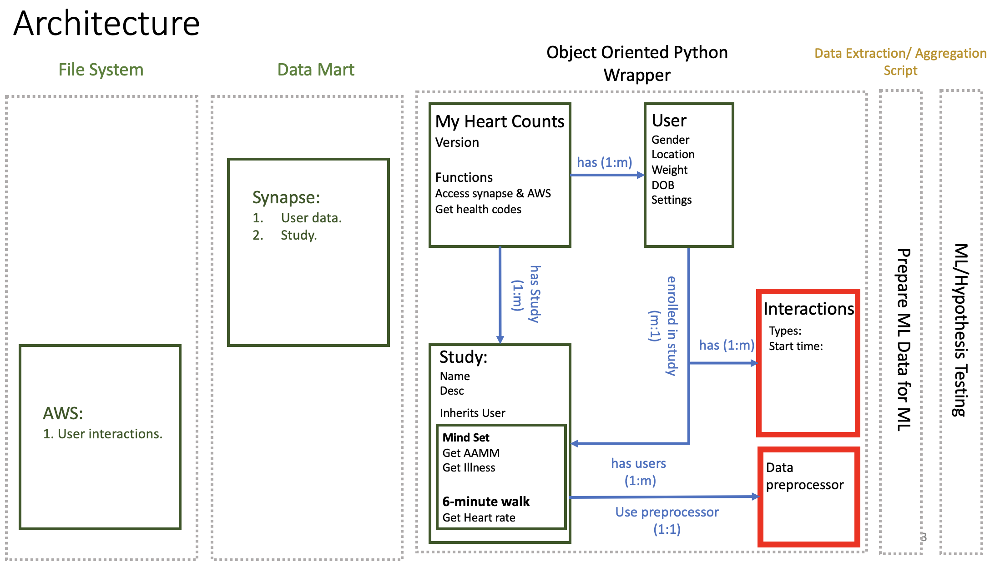

# Machine learning infrastructure for My Heart Counts Studies

## Installation

MyHeartCounts will be available on PyPI




```console
$ pip install 
```

### Install from source


```console
$ python setup.py
```

## Usage


```
see demo.py for example and explaination of usage -- work in progress
Object allows access, cleaning, parsing, and modeling the My Heart Counts data for analysis and machine learning. 

```
